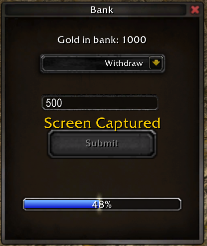

# BankUI

## Overview

**BankUI** is a simple, intuitive banking interface that allows users to deposit and withdraw funds from their bank accounts. Unlike traditional banking applications that may limit the amount of money that can be stored or managed due to integer size constraints, BankUI leverages the power of BigInt to handle monetary values. This means that users can store and manage extremely large amounts of money without worrying about overflow issues.

## Features

- **Deposit Funds**: Easily add money to your account with a simple deposit interface.
- **Withdraw Funds**: Withdraw money from your account whenever needed.
- **BigInt Storage**: Utilizes BigInt for storing and handling monetary values, ensuring that the application can manage large sums of money without limitations.

## Technology

[Eluna](https://github.com/ElunaLuaEngine/Eluna)

[AIO](https://github.com/Rochet2/AIO)

### Prerequisites

Before getting started with BankUI, make sure you have the following prerequisites:

- A working AIO server. If you don't have one, you can follow the [AIO Installation Guide](https://github.com/Rochet2/AIO).
- A working Eluna installation. If you don't have one, you can follow the [Eluna Installation Guide](https://github.com/ElunaLuaEngine/Eluna/blob/master/README.md).
- The `account_bank` table created in your database. Make sure it is added to the `auth` database:

  ```sql
  CREATE TABLE `auth`.`account_bank` (
    `account_id` INT(10) UNSIGNED NOT NULL,
    `gold_amount` BIGINT(20) UNSIGNED NOT NULL DEFAULT '0',
    PRIMARY KEY (`account_id`) USING BTREE
  )
  COLLATE='utf8mb4_unicode_ci'
  ENGINE=InnoDB;
  ```

### Installation

- Clone the repository:

   ```bash
   git clone https://github.com/yourusername/BankUI.git
   ```

- Copy the `BankUI` folder to your server's `scripts` directory. If you're using AIO, the path should look like this:

  ```lua
  AIO_Server/scripts/BankUI
  ```

- Copy the sql code in the readme to your database. This will create the `account_bank` table in your `auth` database.

- Add the blp files to your client's `Interface` folder. The path should look like this:

  ```lua
  Interface\BankUI
   ```


