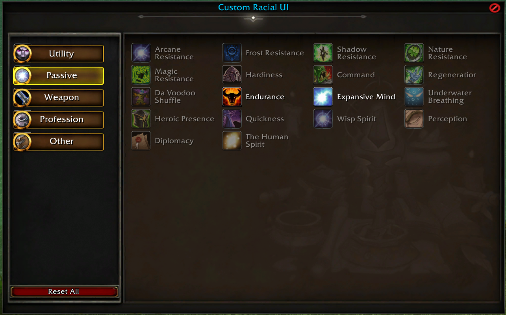
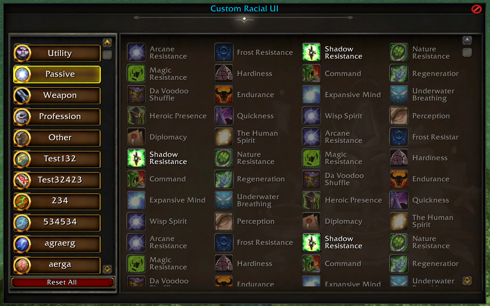

# A Custom Racial UI

## Prerequisites

* [AIO](https://github.com/Rochet2/AIO) Installed
* [Eluna](https://github.com/ElunaLuaEngine/Eluna/blob/master/README.md) Installed

## installation instructions

1. Put contents of "Client" in a patch
2. Put contents of "Server" in the Lua scripts directory on the server

## Usage

* Ingame you can type "/racialchange" to open the UI. Can be changed in the lua file. "racialClient"
* In the lua file "racialClient" you can change the tab, spells, and the max amount of allowed spells to be learned in each tab.

* UI from [Vlad's/Foe StoreSystem check it out!](https://github.com/Foereaper/Eluna-AIO-StoreSystem).
* A custom UI for the Racial all races use.
each tab/Window can basically have a "infinite" set of spell added so a scroll bar appear at a certain point. It's all set up in the lua file. So if

[Racial UI Video](https://streamable.com/53em1x)

