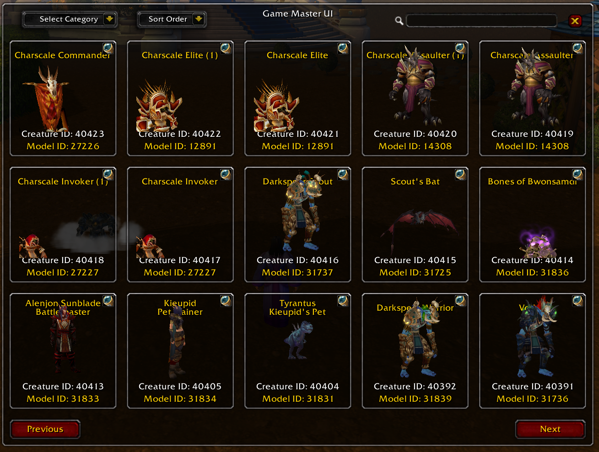
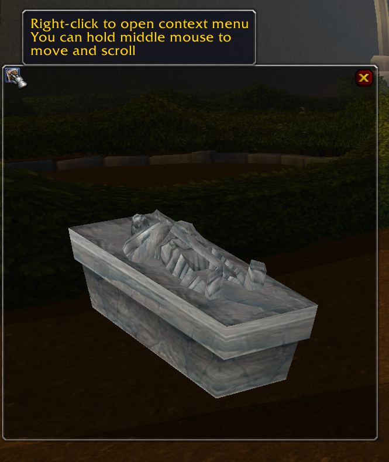
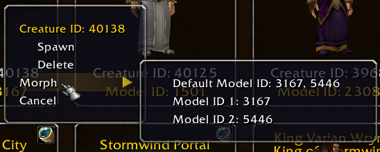

# Game master UI

## Requirements

Require Eluna and AIO.
Require that you have dbc file gameobjectdisplayinfo, spellvisualeffectname inside the db. I HIGHLY RECOMMEND TO ADD EVERY DBC TO YOUR DB.

## Installation

if you have issue adding dbc to db try use [stoneharry spell editor](https://github.com/stoneharry/WoW-Spell-Editor) worked for me.

## Visual aGuide

1. Navigate to your server's `lua_scripts/AIO_Server` directory.
2. Place the `gameMasterClient.lua` and `gameMasterServer.lua` files in this directory.

Here's a visual representation:

```plaintext
lua_scripts/
└── AIO_Server/
  ├── GameMasterSystem/
  │   ├── gameMasterClient.lua
  │   └── gameMasterServer.lua
```

<div style="display: flex; gap: 10px;">
  
  
  
</div>

[video new version](https://streamable.com/8qgjde)

[video old version](https://streamable.com/e76v5t)

# Search Guide for Game Objects and NPC Types

To perform a search for game object types or NPC types, you need to specify the type in parentheses (e.g., `(beast)`). Below are the available types you can use in your searches.

<div style="display: flex; gap: 20px;">

<div style="flex: 1;">

### Game Object Types

To search for game object types, use the syntax `(type)`. Here’s a list of the available types:

| **Game Object Type**    | **Value** |
| ----------------------- | --------- |
| `door`                  | 0         |
| `button`                | 1         |
| `questgiver`            | 2         |
| `chest`                 | 3         |
| `binder`                | 4         |
| `generic`               | 5         |
| `trap`                  | 6         |
| `chair`                 | 7         |
| `spell focus`           | 8         |
| `text`                  | 9         |
| `goober`                | 10        |
| `transport`             | 11        |
| `areadamage`            | 12        |
| `camera`                | 13        |
| `map object`            | 14        |
| `mo transport`          | 15        |
| `duel arbiter`          | 16        |
| `fishingnode`           | 17        |
| `summoning ritual`      | 18        |
| `mailbox`               | 19        |
| `do not use`            | 20        |
| `guardpost`             | 21        |
| `spellcaster`           | 22        |
| `meetingstone`          | 23        |
| `flagstand`             | 24        |
| `fishinghole`           | 25        |
| `flagdrop`              | 26        |
| `mini game`             | 27        |
| `do not use 2`          | 28        |
| `capture point`         | 29        |
| `aura generator`        | 30        |
| `dungeon difficulty`    | 31        |
| `barber chair`          | 32        |
| `destructible_building` | 33        |
| `guild bank`            | 34        |
| `trapdoor`              | 35        |

</div>

<div style="flex: 1;">

### NPC Types

To search for NPC types, use the syntax `(type)`. Here’s a list of the available NPC types:

| **NPC Type**     | **Value** |
| ---------------- | --------- |
| `none`           | 0         |
| `beast`          | 1         |
| `dragonkin`      | 2         |
| `demon`          | 3         |
| `elemental`      | 4         |
| `giant`          | 5         |
| `undead`         | 6         |
| `humanoid`       | 7         |
| `critter`        | 8         |
| `mechanical`     | 9         |
| `not specified`  | 10        |
| `totem`          | 11        |
| `non-combat pet` | 12        |
| `gas cloud`      | 13        |
| `wild pet`       | 14        |
| `aberration`     | 15        |

</div>

</div>

## Example Search Queries

- To search for NPCs of type **beast**, use: `(beast)`
- To search for a **trapdoor** game object, use: `(trapdoor)`

You can copy and paste these examples directly into your search to get the desired results. Make sure you always enclose the type in parentheses.
