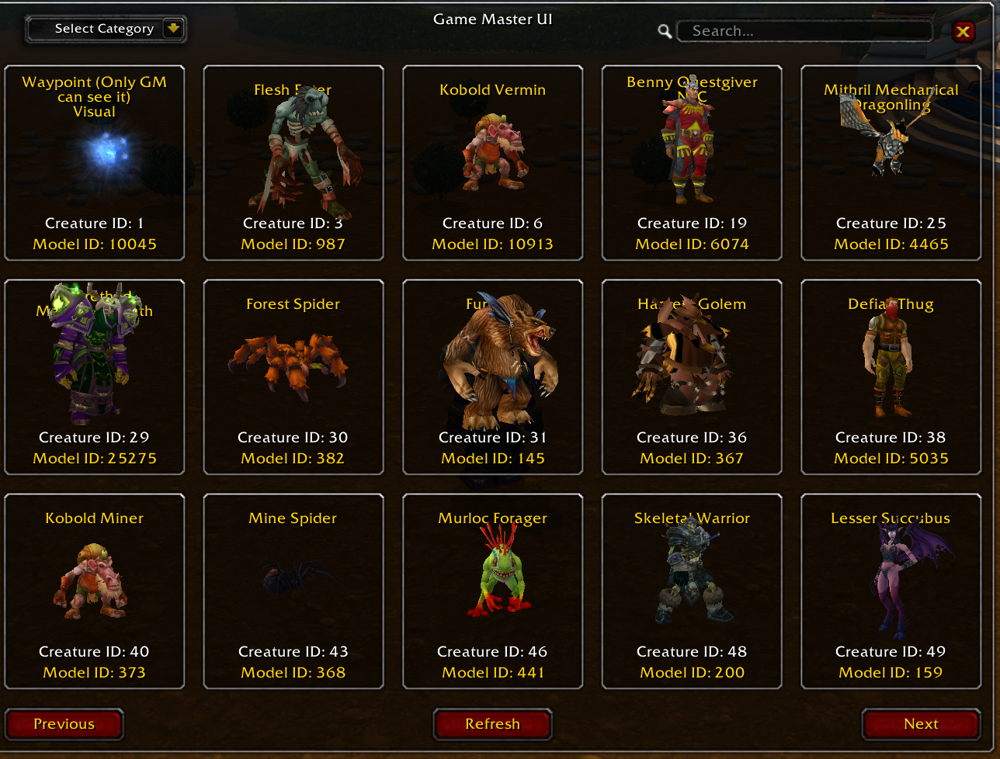

# Game master UI

## Requirements

Require Eluna and AIO.
Require that you have dbc files inside the db.

## Installation

if you have issue adding dbc to db try use [stoneharry](https://github.com/stoneharry/WoW-Spell-Editor) worked for me
put the folder in you server lua_scripts/AIO_Server folder the "gameMasterClient.lua" and "gameMasterServer.lua"

## Visual Guide

1. Navigate to your server's `lua_scripts/AIO_Server` directory.
2. Place the `gameMasterClient.lua` and `gameMasterServer.lua` files in this directory.

Here's a visual representation:

```
lua_scripts/
└── AIO_Server/
  ├── GameMasterSystem/
  │   ├── gameMasterClient.lua
  │   └── gameMasterServer.lua
```


[video](https://streamable.com/e76v5t)