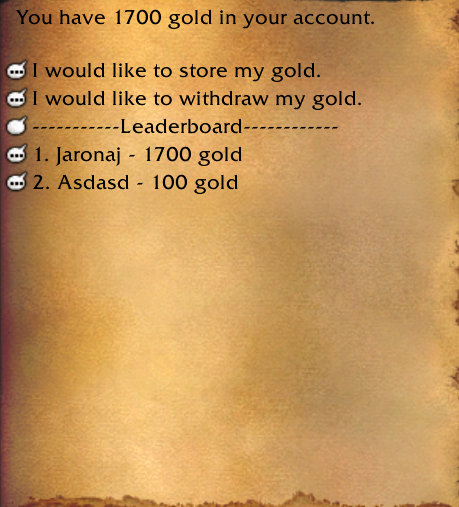

# Gold Storage

## Description

Set npcEntry.
creates a table automatically custom_gold_storage in db once when you launch server for the first time.
Feel free to change the table name if you want to.

```lua
CharDBQuery(
  "CREATE TABLE IF NOT EXISTS `This_is_where` (`account` int(11) NOT NULL, `name` varchar(255) NOT NULL, `gold` int(11) NOT NULL, PRIMARY KEY (`account`)) ENGINE=InnoDB DEFAULT CHARSET=utf8;"
)
```


