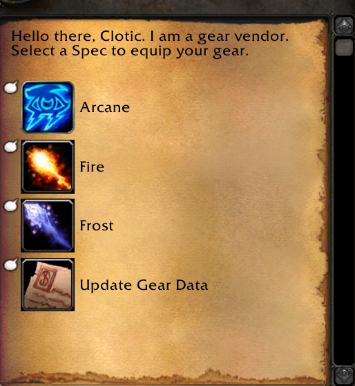
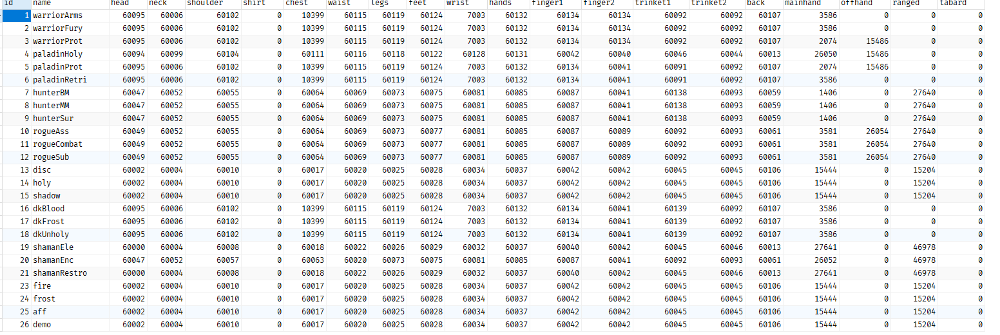

# Automatic gear equipper

This will automatically equip the gear based on spec the persons set in database when they select the option they want to equip.
.slothelp will show u the intid that is used for each spec.

Using the equipper:
1. command .slothelp will show u the intid that is used for each spec.
2. table made with "slotitem table". Example: .slotitem custom_gear_equip
3. after table is created u can do slotitem custom_gear_equip nameofspec intid from slothelp so example: .slotitem custom_gear_equip warriorArms 1
4. One all above i done get the other script and set the  local sqlWordldTableName = "custom_gear_equip"

