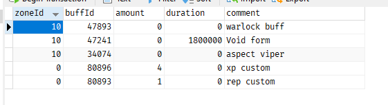

## ZoneBuffs

- Check inside files for more info on how to use it.

- `#zonebuff add` - Adds a buff to the zone you are in.
- `#zonebuff addzone` - Adds aura to current player's zone.
- `#zonebuff del` - Deletes aura from a specific zone.
- `#zonebuff help` - Displays all available commands.
- `#zonebuff update` - Updates an aura's details in a specific zone.
- `#zonebuff list` - Lists all auras in all zones or lists all auras in a specific zone if zoneId is provided.
- `#zonebuff refresh` - Refreshes the list of all auras in all zones or in a specific zone if zoneId is provided.

e.g. `#zonebuff addzone buffId, amount, duration, comment` - Adds aura to current player's zone. can set amount to 0 and duration to 0 for default.

same with `#zonebuff add` but it will need a zone to be set. zoneId, buffId, amount, duration, comment same as above you can set default 0 for amount and duration. 

del is the same as add but it will delete the aura from the zone. zoneId, buffId required. to be set eg `#zonebuff del zoneId, buffId`  

