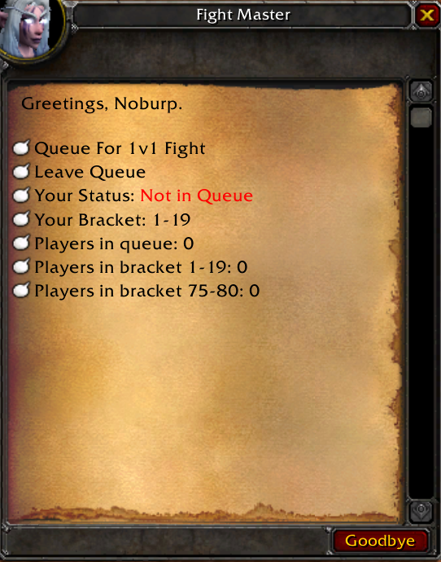

# 1v1 script for Eluna

### Features

- Reward system for winning and losing done with sql table look below
- Brackets system for 1v1 fights


### WIP - not finished yet missing functions

- Raiting system not added yet

### look inside script for more info

### SQL Table

```sql
CREATE TABLE `custom_fight_rewards` (
 `id` INT(10) UNSIGNED NOT NULL AUTO_INCREMENT,
 `condition` ENUM('WIN','LOSE') NOT NULL COLLATE 'utf8mb4_unicode_ci',
 `reward_type` ENUM('ITEM','MONEY') NOT NULL COLLATE 'utf8mb4_unicode_ci',
 `entry` INT(10) UNSIGNED NULL DEFAULT NULL,
 `amount` INT(10) UNSIGNED NULL DEFAULT '1',
 `enabled` TINYINT(1) NOT NULL DEFAULT '1',
 `description` VARCHAR(100) NULL DEFAULT NULL COLLATE 'utf8mb4_unicode_ci',
 PRIMARY KEY (`id`) USING BTREE
)
COLLATE='utf8mb4_unicode_ci'
ENGINE=InnoDB
AUTO_INCREMENT=6
;
```

if you set amount for money to 1 it will give the correct amount else it will double the amount you set


